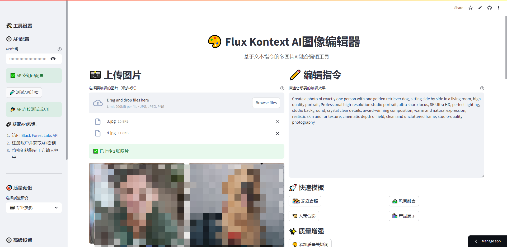

# 🎨 Flux Kontext Streamlit Web界面

基于Web的多图片AI编辑工具，提供直观的图形界面来使用Flux Kontext API进行图像编辑和融合。



## 📋 功能特性

-   🌐 **Web界面**: 无需命令行，通过浏览器操作
-   🔑 **简单配置**: 直接在页面配置API密钥
-   📸 **多图片支持**: 最多同时处理4张图片
-   🎯 **质量预设**: 内置多种质量预设选项
-   ⚙️ **参数调节**: 完整的参数控制界面
-   📥 **结果下载**: 直接下载编辑后的图片
-   💡 **使用指导**: 内置使用技巧和建议

## 🚀 快速开始

### 1. 安装依赖

```bash
pip install -r requirements.txt
```

### 2. 启动应用

```bash
streamlit run streamlit_app.py
```

### 3. 打开浏览器

应用会自动在浏览器中打开，通常地址为：`http://localhost:8501`

## ⚙️ API配置

### 页面配置（简单快捷）

1. 在侧边栏的"⚙️ API配置"部分
2. 输入您的API密钥
3. 点击 "🧪 测试API连接" 验证
4. 开始使用

**获取API密钥:**

1. 访问 [Black Forest Labs API](https://api.bfl.ai)
2. 注册账户并获取API密钥
3. 将密钥粘贴到界面中的输入框

## 🎯 使用步骤

1. **配置API**: 在侧边栏输入您的API密钥
2. **上传图片**: 选择要编辑的图片（最多4张）
3. **输入指令**: 描述您想要的编辑效果
4. **调整参数**: 选择质量预设和高级参数
5. **开始编辑**: 点击"🎨 开始AI编辑"按钮
6. **下载结果**: 编辑完成后下载图片

## 🎨 质量预设

-   **🎯 标准质量**: 基础质量，处理速度快
-   **📸 专业摄影**: 专业级摄影质量
-   **🎬 电影级质量**: 电影级视觉效果
-   **🏆 8K超高清**: 最高质量，8K分辨率
-   **🎨 艺术级**: 艺术摄影风格

## 🚀 快速模板

应用内置多种快速模板：

-   **👨‍👩‍👧‍👦 家庭合照**: 创建温馨家庭肖像
-   **🐕 人宠合影**: 人物与宠物合影
-   **🏞️ 风景融合**: 多个风景图融合
-   **🛍️ 产品展示**: 专业产品展示

## ⚙️ 参数说明

### 基础参数

-   **AI模型**:
    -   `flux-kontext-pro`: 处理速度快
    -   `flux-kontext-max`: 质量更高
-   **宽高比**: 支持多种比例 (1:1, 4:3, 16:9等)
-   **输出格式**: PNG (高质量) 或 JPEG (小文件)

### 高级参数

-   **安全等级**: 0-6，数值越低创意越多
-   **提示词增强**: AI自动优化提示词
-   **固定种子**: 获得一致的结果

## 💡 使用技巧

### 📸 提示词技巧

-   使用具体、详细的描述
-   指定确切的人数和物体数量
-   添加质量关键词如 "professional photography", "4K resolution"
-   描述光照和构图，如 "natural lighting", "perfect composition"

### ⚙️ 参数建议

-   **高质量**: 选择Max模型 + 启用提示词增强
-   **快速处理**: 选择Pro模型 + 关闭提示词增强
-   **避免多人**: 使用低安全等级(0-2) + 明确数量描述
-   **一致结果**: 使用固定种子

### 🎨 质量关键词

-   基础: `high quality, clear, sharp`
-   专业: `professional photography, studio quality`
-   超高清: `4K resolution, 8K ultra HD, crystal clear`
-   艺术: `masterpiece, fine art, museum quality`

## ⚠️ 常见问题

### Q: 如何获取API密钥？

A: 访问 [Black Forest Labs API](https://api.bfl.ai) 注册账户并获取API密钥

### Q: 为什么出现多余人物？

A: 降低安全等级并使用更明确的提示词，如 "exactly one person"

### Q: 如何提高图片质量？

A: 选择Max模型并添加质量关键词，如 "4K resolution, professional photography"

### Q: 处理失败怎么办？

A: 检查API密钥和网络连接，确保图片格式正确

## 🔗 相关链接

-   [Flux Kontext API文档](https://docs.bfl.ai/)
-   [获取API密钥](https://api.bfl.ai)
-   [Streamlit官方文档](https://docs.streamlit.io/)

## 📝 技术支持

如果遇到问题，请检查：

1. API密钥是否正确
2. 网络连接是否正常
3. 图片格式是否支持 (JPG, JPEG, PNG)
4. 图片大小是否合理

---

🎨 **Powered by Flux Kontext API** | Made with ❤️ using Streamlit
